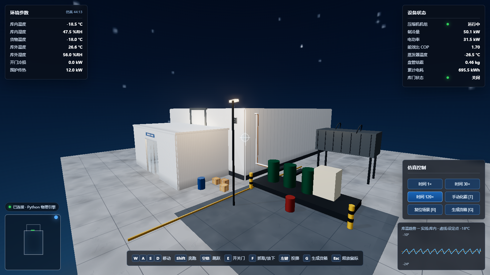
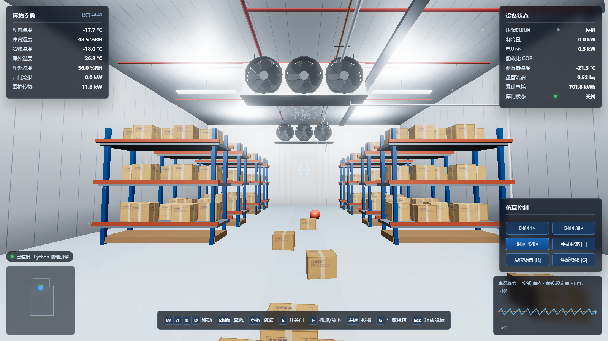
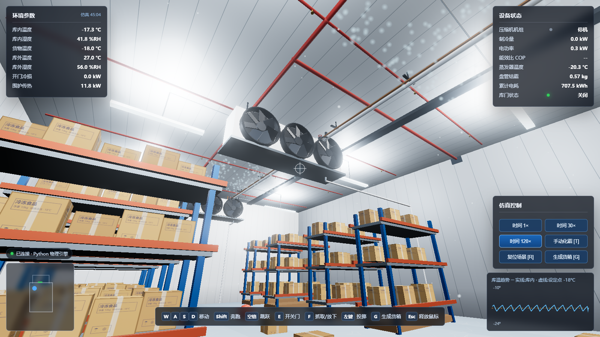
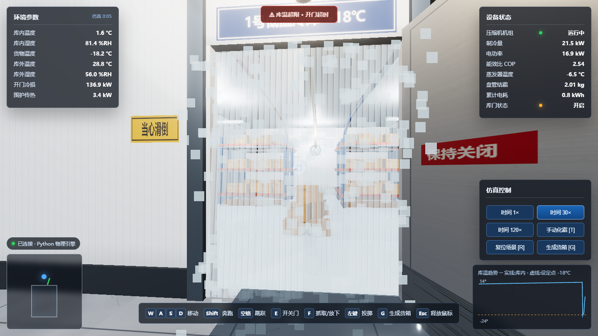

# Cold Storage Digital Twin · Real Physics, Driven by Python

**English** | [简体中文](README.zh-CN.md)


A first-person 3D cold storage facility simulation where **everything is real physics,
computed in Python**: a MuJoCo rigid-body world (a servo-driven sliding freezer door you
can jam with crates, boxes you can shove, grab and throw) coupled with a first-principles
refrigeration thermodynamics model (door-open air infiltration tempered by a vestibule and
air curtain, compressor cycling, evaporator frosting and defrost). The 14 × 18 × 6 m
freezer hall stores 40 t of frozen goods on 8 rack lines, cooled by two ceiling-mounted
unit coolers (6 fans, 52 kW rated) under fully modeled services — refrigerant piping,
fire sprinklers, cable trays and conduit. The browser only renders — the entire simulated
world lives on the server and is streamed over WebSocket at 30 Hz.

| Exterior at dusk | Inside the freezer hall |
| --- | --- |
|  |  |
| **Ceiling unit coolers & services** | **Cold air spilling out** |
|  |  |

> **For AI assistants / anyone deploying this:** the three commands under
> **Quick Start** are all you need. No build step, no database, no GPU on the server,
> no network access at runtime (Three.js is vendored in `frontend/vendor/`).
> If anything fails, jump to **Troubleshooting**.

---

## Quick Start

Requirements: **Python 3.10 – 3.14** (developed on 3.14), Windows / macOS / Linux,
a modern browser (Chrome / Edge / Firefox).

```bash
# 1. Enter the project directory
cd cold-storage-sim

# 2. Install dependencies (just 4 packages)
pip install -r requirements.txt

# 3. Run (port 8017 by default; opens your browser automatically)
python run.py
```

Then visit **http://127.0.0.1:8017**.

- On Windows you can simply **double-click `start.bat`** (installs missing deps automatically).
- On macOS / Linux: `bash start.sh`.
- Different port: `python run.py 8080`.

If `pip install` stalls or drops connections (common in mainland China), use a mirror:

```bash
pip install -r requirements.txt -i https://pypi.tuna.tsinghua.edu.cn/simple
```

Verify the server is up:

```bash
curl http://127.0.0.1:8017/api/state    # should return a JSON snapshot
```

---

## Controls

| Key | Action |
| --- | --- |
| Click "进入冷库巡检" | Enter first-person mode (pointer lock) |
| W / A / S / D + mouse | Move / look (Shift to run, Space to jump) |
| E | Open / close the sliding door (servo-driven, real mass — a crate in the doorway will jam it) |
| F | Grab / release the crate, barrel or ball under your crosshair |
| Left click | Throw the held object |
| G | Spawn a new crate in front of you |
| R | Reset the whole scene (rigid bodies + thermodynamics) |
| T | Manual defrost |
| 1 / 2 / 3 | Thermodynamics time scale 1× / 30× / 120× |
| Left click (aim at a ❄ knowledge cloud) | Floating clouds mark each heat-transfer hotspot; aim to get a confirm button, click to open the lesson popup |
| Esc | Release the mouse (to use the control panel buttons) |

**Suggested tour:** press `2` (30× time), slide the door open with `E`, and watch the
infiltration load jump past 50 kW on the HUD (the vestibule and air curtain are all
that keep it from tripling) while the room temperature climbs, fog pours out through
the PVC strip curtain and the over-temperature / door-open alarms fire. Close the door
and watch the compressor claw the temperature back down; the moisture you let in frosts
up the evaporator coil, and past 8 kg of frost a defrost cycle kicks in automatically —
the ceiling fans stop spinning while it runs. Throw a crate into the doorway and try
to close the door on it.

---

## Interactive Heat-Transfer Lessons

Every part of the cold room doubles as a heat-transfer lesson. Visible **❄ knowledge
clouds** float at each hotspot (walls, roof, floor, door, unit coolers, fans, ceiling
pipes, cargo racks); aim at one and a confirm button appears — click to open the lesson
popup and jump into the dedicated page. Lesson pages are designed for **classroom
projection**: white background, large type, KaTeX-typeset formulas, and a five-part
slide flow (physics picture → key equations → interactive experiment → worked example
→ pitfalls), with arrow-key paging. The full atlas of 11 lessons lives at `/kp/`; all
physics runs in the browser and matches the worked examples in `docs/kp/`.

---

## Architecture

```
Browser (Three.js rendering + input only)
        ↕ WebSocket, 30 Hz state stream / commands
Python backend (FastAPI, 60 Hz main loop)
        ├── MuJoCo 3.x rigid-body physics: servo-driven sliding door / 12+ crates /
        │   barrels / ball / kinematic player collider (shove crates around) /
        │   PD-force grabbing / throwing
        └── Thermodynamics: envelope conduction + Gosney-Olama door infiltration
            (tempered by vestibule & air curtain) + door-frame heater + thermostat-
            cycled compressor (Carnot-derated COP) + twin unit-cooler fan load +
            evaporator frosting & electric defrost + Magnus humidity balance +
            product thermal mass — door opening fraction comes from the physics
            engine's actual door travel
```

### Project layout

```
cold-storage-sim/
├── run.py                  # entry point: python run.py [port]
├── start.bat / start.sh    # one-click launchers (auto-install deps)
├── requirements.txt        # fastapi / uvicorn / mujoco / numpy
├── backend/
│   ├── server.py           # FastAPI + WebSocket server, 60 Hz sim loop
│   ├── physics.py          # MuJoCo world (sliding door / crates / grab & throw)
│   └── thermal.py          # cold-room thermodynamics (first principles)
└── frontend/               # static, served by the backend, no build step
    ├── index.html
    ├── css/style.css
    └── js/
        ├── main.js         # Three.js scene + WebSocket sync + input
        ├── textures.js     # procedural Canvas textures (no image files)
        └── ../vendor/      # three.js 0.164.1 + addons, fully vendored
```

### HTTP / WebSocket API

- `GET /api/state` — full snapshot (rigid-body poses + thermodynamic state)
- `GET /api/history` — temperature / power history series
- `WS /ws` — `init` message (scene manifest) on connect, then a 30 Hz `state`
  stream; client commands: `door` `grab` `throw` `spawn` `reset` `defrost`
  `speed` `player`

---

## Troubleshooting (AI-assistant friendly)

| Symptom | Cause & fix |
| --- | --- |
| `pip install` fails / connection drops | Use the Tsinghua mirror: `pip install -r requirements.txt -i https://pypi.tuna.tsinghua.edu.cn/simple` |
| `No matching distribution found for mujoco` | Python too old/new for prebuilt wheels — install Python 3.10–3.14, 64-bit |
| Port 8017 already in use | Run on another port: `python run.py 8020` |
| Page loads but shows "连接断开" (disconnected) | The backend isn't running — check the `python run.py` terminal for errors |
| Blank page / stale behavior | Browser cache — hard refresh with Ctrl+F5 |
| `ImportError: DLL load failed` (Windows, mujoco) | Install the [VC++ redistributable](https://aka.ms/vs/17/release/vc_redist.x64.exe) |
| Clicking "enter" does nothing | Browser blocked pointer lock — click again; don't run inside an iframe |
| Low frame rate | Normal on integrated GPUs (~40–60 fps); close other GPU-heavy apps |

Implementation notes: the main loop is `sim_loop()` in `backend/server.py`; physics
steps at 4 ms, the state stream at 30 Hz, thermodynamics defaults to 30× time (UI
adjustable). All frontend textures are generated procedurally on a Canvas at runtime
and every Three.js module is vendored — **the project runs fully offline** (network
is only needed once, for `pip install`).

## License

[MIT](LICENSE)
